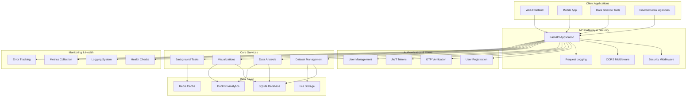
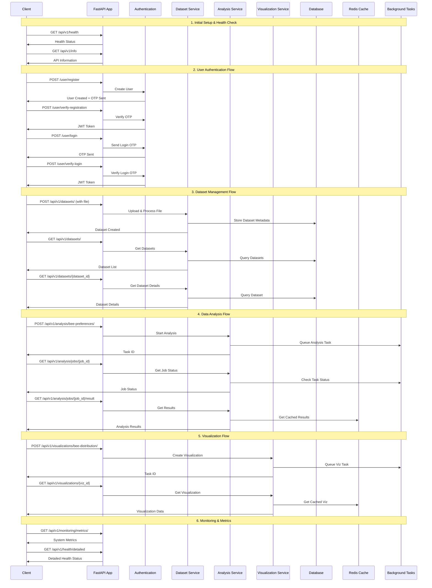
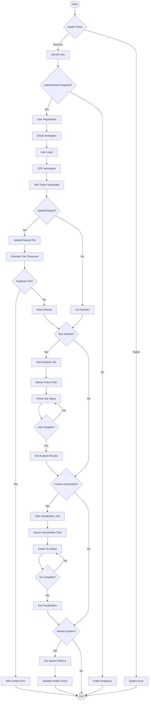
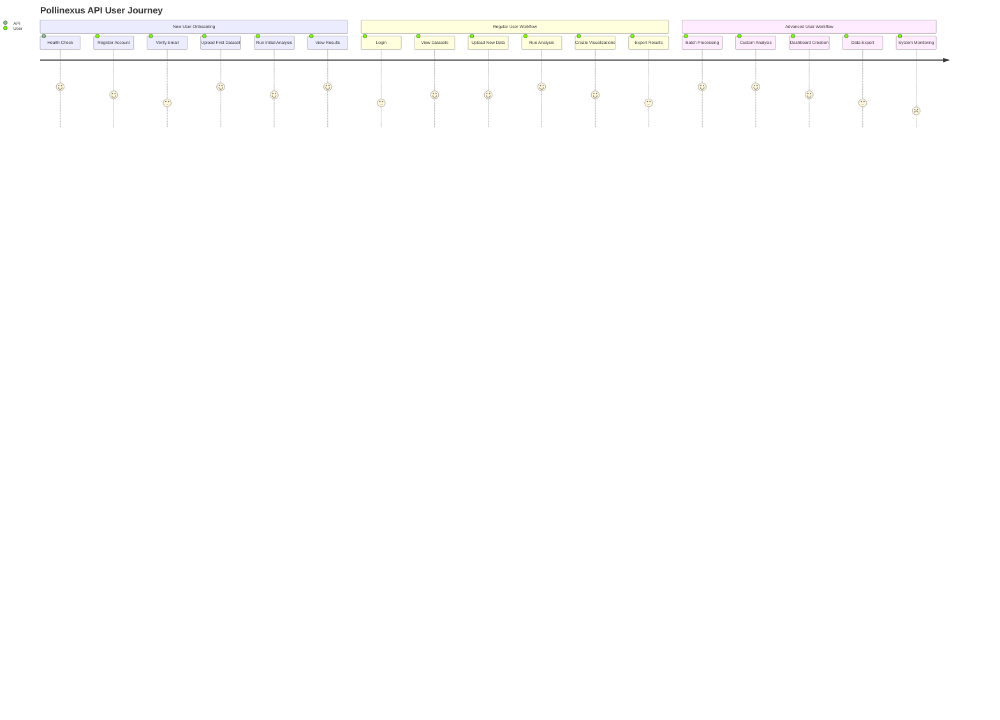
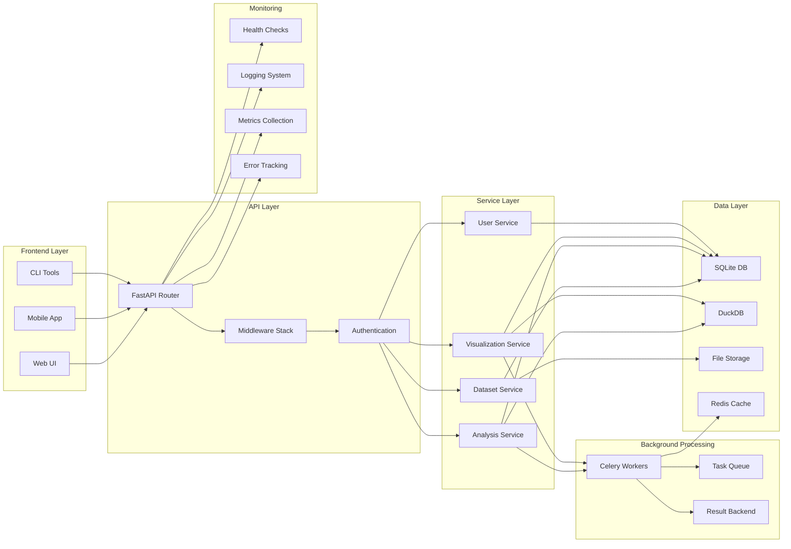

# Pollinexus API Flow & Endpoints Guide

## API Architecture Overview

## API Endpoint Flow Sequence

## Detailed API Endpoints Flow

## User Journey Flow

## System Components Interaction

## API Endpoints Summary

### Health & Information
- `GET /api/v1/health` - Quick health check
- `GET /api/v1/health/detailed` - Comprehensive health status
- `GET /api/v1/info` - API information and capabilities
- `GET /api/v1/` - Root endpoint
- `GET /api/v1/security/status` - Security monitoring status
- `GET /api/v1/metrics` - System metrics

### User Authentication
- `POST /user/register` - Register new user
- `POST /user/send-verification` - Send verification code
- `POST /user/verify-registration` - Verify registration OTP
- `POST /user/login` - Request login OTP
- `POST /user/verify-login` - Verify login OTP
- `GET /api/v1/user/me` - Get current user info

### Dataset Management
- `POST /api/v1/datasets/` - Upload new dataset
- `GET /api/v1/datasets/` - List all datasets
- `GET /api/v1/datasets/{id}` - Get specific dataset
- `PUT /api/v1/datasets/{id}` - Update dataset
- `DELETE /api/v1/datasets/{id}` - Delete dataset
- `POST /api/v1/datasets/search` - Search datasets
- `POST /api/v1/datasets/filter` - Filter datasets
- `GET /api/v1/datasets/{id}/health` - Dataset health check

### Data Analysis
- `POST /api/v1/analysis/bee-preferences/` - Bee preferences analysis
- `POST /api/v1/analysis/plant-recommendations/` - Plant recommendations
- `POST /api/v1/analysis/seasonal/` - Seasonal analysis
- `POST /api/v1/analysis/site-comparison/` - Site comparison
- `GET /api/v1/analysis/jobs/` - List analysis jobs
- `GET /api/v1/analysis/jobs/{id}` - Get job status
- `GET /api/v1/analysis/jobs/{id}/result` - Get job results
- `DELETE /api/v1/analysis/jobs/{id}` - Cancel job

### Visualizations
- `POST /api/v1/visualizations/bee-distribution/` - Bee distribution plot
- `POST /api/v1/visualizations/seasonal-patterns/` - Seasonal patterns
- `POST /api/v1/visualizations/site-comparison/` - Site comparison plot
- `POST /api/v1/visualizations/dashboard/` - Interactive dashboard
- `GET /api/v1/visualizations/{id}` - Get visualization
- `POST /api/v1/visualizations/batch/` - Batch visualization
- `GET /api/v1/visualizations/jobs/` - List viz jobs
- `GET /api/v1/visualizations/jobs/{id}` - Get viz job status
- `DELETE /api/v1/visualizations/jobs/{id}` - Cancel viz job

### Monitoring
- `GET /api/v1/monitoring/metrics/` - Get monitoring metrics
- `POST /api/v1/monitoring/metrics/reset/` - Reset monitoring metrics

## Key Features

- **File Upload with Checksum Validation**: Prevents duplicate uploads
- **Background Processing**: Long-running tasks via Celery
- **Real-time Monitoring**: Job status and system metrics
- **Comprehensive Logging**: Structured JSON logs with correlation IDs
- **Security Middleware**: Rate limiting, input validation, CORS
- **Health Checks**: System and component health monitoring
- **User Authentication**: OTP-based email verification
- **Data Analysis**: Bee preferences, plant recommendations, seasonal analysis
- **Visualizations**: Interactive plots and dashboards 